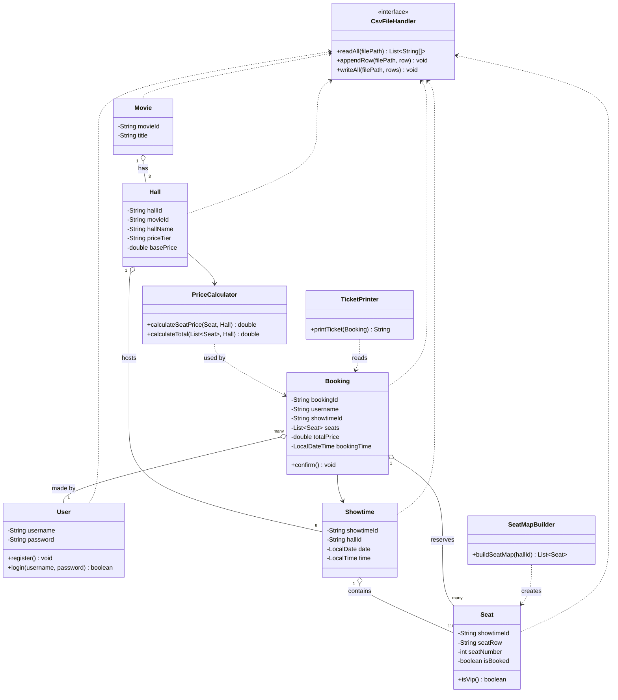

# ระบบจองตั๋วภาพยนตร์ (Movie Ticket Booking System)

ระบบจองตั๋วภาพยนตร์แบบครบวงจร ให้ลูกค้าสมัครสมาชิก/เข้าสู่ระบบ เลือกหนัง เลือกโรง เลือกวันและรอบฉาย เลือกที่นั่งได้หลายที่นั่งพร้อมกัน แล้วยืนยันคำสั่งซื้อเพื่อรับตั๋วหนังจำลอง

พัฒนาด้วยภาษา Java 100% แสดงผลผ่าน Java Swing และเก็บข้อมูลทั้งหมดในไฟล์ CSV (ไม่ใช้ฐานข้อมูล)

---

## 1. สมาชิกกลุ่มและความรับผิดชอบ

| รหัสนักศึกษา | ชื่อ-นามสกุล | บทบาท | ความรับผิดชอบ |
| --- | --- | --- | --- |
| | | Data & Storage Developer | `Movie`, `Hall`, `Showtime`, `Seat`, `User`, `CsvFileHandler` |
| | | UI Developer (Login & Selection) | `LoginFrame`, `MovieSelectFrame`, `HallSelectFrame`, `ShowtimeSelectFrame` |
| | | UI Developer (Seat Map & Payment) | `SeatMapFrame`, `SeatMapBuilder`, `PriceCalculator`, `PaymentFrame` |
| | | Booking & Ticket Developer | `Booking`, `TicketPrinter`, `TicketFrame`, integration testing |

---

## 2. ผู้ใช้งานระบบ

ระบบมีผู้ใช้งานหลักกลุ่มเดียวคือ **ลูกค้า (Customer)** ซึ่งต้องสมัครสมาชิก/เข้าสู่ระบบก่อนจึงจะจองตั๋วได้

### 2.1 ลูกค้า (Customer)

- สมัครสมาชิก / เข้าสู่ระบบ
- เลือกหนังจาก 3 เรื่องที่มีให้เลือก
- เลือกโรง (ถูก/กลาง/แพง) ของหนังเรื่องนั้นได้อย่างอิสระ ไม่ผูกกับวันหรือเวลาฉาย
- เลือกวันฉาย (3 วัน) และรอบเวลา (3 รอบ/วัน)
- เลือกที่นั่งจากผังที่นั่งแบบ real-time (ว่าง/เลือกอยู่/จองแล้ว) ได้หลายที่นั่งพร้อมกัน
- ยืนยันคำสั่งซื้อและจำลองการชำระเงิน
- รับตั๋วหนังจำลอง (mock ticket) ที่รวมทุกที่นั่งของการจองครั้งนั้น

---

## 3. ฟังก์ชันหลักของระบบ

### 3.1 ระบบสมาชิก

สมัครสมาชิกและเข้าสู่ระบบด้วย username/password ต้อง login ก่อนจึงจะจองตั๋วได้

### 3.2 ระบบเลือกหนัง

มีหนังให้เลือก 3 เรื่องคงที่

| Movie ID | ชื่อเรื่อง |
| --- | --- |
| M01 | ธี่หยด |
| M02 | Spider-Man: No Way Home |
| M03 | Star Wars |

### 3.3 ระบบเลือกโรง

หนังแต่ละเรื่องมีโรงเป็นของตัวเอง 3 โรง (ถูก/กลาง/แพง) — รวม 3 หนัง × 3 โรง = 9 โรง ผู้ใช้เลือกโรงได้อย่างอิสระ ไม่ผูกกับวันหรือเวลาฉาย

| ระดับโรง | ราคาที่นั่งปกติ (A–E) | ราคาที่นั่ง VIP (F) |
| --- | --- | --- |
| ถูก | 160 บาท | 200 บาท |
| กลาง | 220 บาท | 260 บาท |
| แพง | 280 บาท | 320 บาท |

### 3.4 ระบบเลือกวันและรอบฉาย

แต่ละโรงฉาย 3 วัน วันละ 3 รอบเวลา รวม 9 รอบฉายต่อโรง ลำดับการเลือกของผู้ใช้คือ **หนัง → โรง → วัน → รอบเวลา → ที่นั่ง**

### 3.5 ระบบเลือกที่นั่ง

ทุกโรงใช้ผังที่นั่งแบบเดียวกัน: แถวปกติ A–E (20 ที่นั่ง/แถว) และแถวพิเศษ F (VIP, 10 ที่นั่ง) รวม 110 ที่นั่งต่อโรงต่อรอบฉาย

```
                     [ จอภาพยนตร์ ]

 แถว A–E (ปกติ)  [1][2][3]...............[20]
 --------------------------------------------
 แถว F (VIP)     [1][2][3]......[10]
```

ที่นั่งแถว F คิดราคาเพิ่ม **40 บาท** จากราคาฐานของโรง (ส่วนต่างนี้เท่ากันทุกระดับราคา) ผู้ใช้เลือกได้หลายที่นั่งพร้อมกัน ระบบแสดงราคารวมอัปเดตทันที

### 3.6 ระบบยืนยันคำสั่งซื้อและจำลองการชำระเงิน

สรุปรายการที่นั่งทั้งหมด + ราคารวม แล้วจำลองการชำระเงิน (ไม่เชื่อมระบบชำระเงินจริง)

### 3.7 ระบบออกตั๋วจำลอง

หลังชำระเงินสำเร็จ ระบบออกตั๋วหนังจำลองที่รวมทุกที่นั่งของการจองครั้งเดียวกันไว้ในตั๋วใบเดียว

---

## 4. เทคโนโลยีที่ใช้

| ส่วน | เทคโนโลยี |
| --- | --- |
| Programming Language | Java |
| User Interface | Java Swing (`JFrame`/`JPanel`, แนะนำใช้ `CardLayout` สลับหน้าจอ) |
| Data Storage | CSV File (Comma-Separated Values) |
| File Handling | `java.io.*`, `java.nio.file.*` |
| Data Structure | `java.util.*` |
| Date & Time | `java.time.*` |
| Version Control | Git / GitHub |

---

## 5. สถาปัตยกรรมของระบบ

```
User Interface (Swing: JFrame/JPanel)
      ↓
Service / Business Logic
      ↓
Model (Movie, Hall, Showtime, Seat, User, Booking)
      ↓
CSV Storage
```

**ตัวอย่างการเข้าสู่ระบบ (Login)**

```
LoginFrame
    ↓
UserManager
    ↓
CsvFileHandler
    ↓
users.csv
```

**ตัวอย่างการจองตั๋ว (Booking)**

```
SeatMapFrame → PriceCalculator (คำนวณราคาต่อที่นั่ง/รวม)
    ↓
Booking (รวมที่นั่งทั้งหมดของการจองครั้งนี้ภายใต้ booking_id เดียวกัน)
    ↓
CsvFileHandler
    ↓
bookings.csv  +  seats.csv (อัปเดตสถานะที่นั่ง)
    ↓
TicketPrinter → TicketFrame
```

---

## 6. การจัดเก็บข้อมูล

ระบบใช้ไฟล์ CSV แทนฐานข้อมูล โดยแยกไฟล์ตามประเภทของข้อมูล

```
data/
├── users.csv
├── movies.csv
├── halls.csv
├── showtimes.csv
├── seats.csv
└── bookings.csv
```

**โครงสร้างแต่ละไฟล์**

```
users.csv      : username,password

movies.csv     : movie_id,title

halls.csv      : hall_id,movie_id,hall_name,price_tier,base_price

showtimes.csv  : showtime_id,hall_id,date,time

seats.csv      : showtime_id,seat_row,seat_number,is_booked

bookings.csv   : booking_id,username,showtime_id,seat_row,seat_number,price,booking_time
```

> ที่นั่งแถว `F` ถือเป็น VIP โดยอัตโนมัติจากชื่อแถว ราคาคำนวณจาก `base_price` ของ `hall_id` (ผ่าน `showtime_id`) บวกส่วนเพิ่ม VIP (+40 บาท) ถ้าเป็นแถว F ไม่ต้องเก็บราคาซ้ำในไฟล์ `seats.csv`
>
> การจอง 1 ครั้งที่มีหลายที่นั่ง บันทึกเป็นหลายแถวใน `bookings.csv` ที่มี `booking_id` เดียวกัน ตอนพิมพ์ตั๋วให้ดึงทุกแถวที่ `booking_id` ตรงกันมารวมในตั๋วใบเดียว

---

## 7. โครงสร้างโปรเจกต์

```
movie-ticket-booking/
├── src/
│   ├── Main.java
│   │
│   ├── model/
│   │   ├── User.java
│   │   ├── Movie.java
│   │   ├── Hall.java
│   │   ├── Showtime.java
│   │   ├── Seat.java
│   │   └── Booking.java
│   │
│   ├── service/
│   │   ├── UserManager.java
│   │   ├── PriceCalculator.java
│   │   ├── SeatMapBuilder.java
│   │   └── TicketPrinter.java
│   │
│   ├── storage/
│   │   └── CsvFileHandler.java
│   │
│   └── ui/
│       ├── LoginFrame.java
│       ├── MovieSelectFrame.java
│       ├── HallSelectFrame.java
│       ├── ShowtimeSelectFrame.java
│       ├── SeatMapFrame.java
│       ├── PaymentFrame.java
│       └── TicketFrame.java
│
├── data/
├── docs/
├── .gitignore
└── README.md
```

**หน้าที่ของแต่ละส่วน**
- `model/` — คลาสข้อมูลหลักของระบบ
- `service/` — Business logic (ล็อกอิน, คำนวณราคา, สร้างผังที่นั่ง, สร้างตั๋ว)
- `storage/` — อ่าน/เขียนไฟล์ CSV แบบ generic ใช้ร่วมกันทุกคลาส
- `ui/` — ส่วนติดต่อผู้ใช้งาน (Java Swing)
- `data/` — ไฟล์ข้อมูล .csv
- `docs/` — เอกสารและ diagram ประกอบโครงงาน

---

## 8. ข้อมูลโครงงาน

- **รายวิชา:** Software Construction
- **หัวข้อ:** ระบบจองตั๋วภาพยนตร์ (เลือกหนัง 3 เรื่อง, โรงแยกตามหนัง, ที่นั่งปกติ + VIP)
- **จำนวนสมาชิก:** 4 คน

โครงงานนี้จัดทำขึ้นเพื่อการศึกษา และเป็นส่วนหนึ่งของรายวิชา Software Construction

---

## ภาคผนวก A: Class Diagram



---

